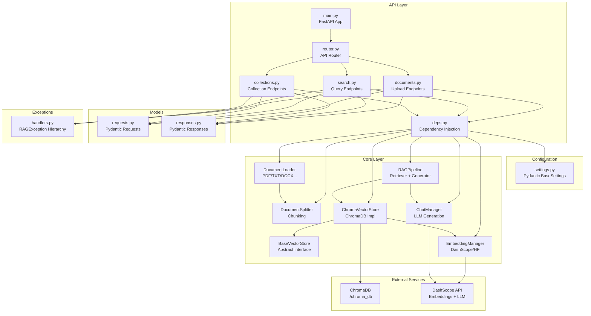

# RAG Backend 项目架构图

## 1. 整体架构（分层视图）

```
┌─────────────────────────────────────────────────────────────────────────────┐
│                              CLIENT LAYER                                   │
│  ┌─────────────────────────────────────────────────────────────────────────┐│
│  │  Vue.js Frontend (rag_front)                                           ││
│  │  • RagChat.vue                                                        ││
│  │  • Element Plus UI                                                    ││
│  └─────────────────────────────────────────────────────────────────────────┘│
└─────────────────────────────────────────────────────────────────────────────┘
                                      │ HTTP/JSON
                                      ▼
┌─────────────────────────────────────────────────────────────────────────────┐
│                              API LAYER                                      │
│  ┌─────────────────────────────────────────────────────────────────────────┐│
│  │  FastAPI Application (backend/app/main.py)                             ││
│  │  ├─ CORS Middleware                                                   ││
│  │  ├─ Exception Handlers                                                ││
│  │  └─ Auto-generated OpenAPI docs (/docs)                               ││
│  └─────────────────────────────────────────────────────────────────────────┘│
│                                    │                                        │
│  ┌─────────────────────────────────┴──────────────────────────────────────┐│
│  │  API Router (/api/vector) - backend/app/api/router.py                  ││
│  │  ├─ documents.py   (POST /upload_file, POST /upload_document)         ││
│  │  ├─ search.py      (POST /query, POST /search)                        ││
│  │  └─ collections.py (GET /collection_info, POST /clear_collection)     ││
│  └─────────────────────────────────────────────────────────────────────────┘│
└─────────────────────────────────────────────────────────────────────────────┘
                                      │ Depends()
                                      ▼
┌─────────────────────────────────────────────────────────────────────────────┐
│                         SERVICE LAYER (DI)                                  │
│  ┌─────────────────────────────────────────────────────────────────────────┐│
│  │  Dependency Injection (backend/app/api/deps.py)                        ││
│  │  ├─ get_embedding_manager()  ──► EmbeddingManager (singleton)         ││
│  │  ├─ get_vector_store()       ──► ChromaVectorStore (singleton)        ││
│  │  ├─ get_chat_manager()       ──► ChatManager (singleton)              ││
│  │  ├─ get_rag_pipeline()       ──► RAGPipeline (singleton)              ││
│  │  ├─ get_document_loader()    ──► DocumentLoader                       ││
│  │  └─ get_document_splitter()  ──► DocumentSplitter                     ││
│  └─────────────────────────────────────────────────────────────────────────┘│
└─────────────────────────────────────────────────────────────────────────────┘
                                      │
                                      ▼
┌─────────────────────────────────────────────────────────────────────────────┐
│                              CORE LAYER                                     │
│  ┌─────────────────────────────────────────────────────────────────────────┐│
│  │  RAG Pipeline (backend/app/core/retriever/rag.py)                      ││
│  │  ├─ search()     → Vector similarity search                           ││
│  │  └─ answer()     → Retrieve → Generate → Confidence scoring           ││
│  └─────────────────────────────────────────────────────────────────────────┘│
│                                    │                                        │
│  ┌─────────────────────────────────┼──────────────────────────────────────┐│
│  │         CORE MODULES            │                                      ││
│  │  ┌─────────────────┐  ┌─────────────────┐  ┌─────────────────┐        ││
│  │  │  Vector Store   │  │  Document       │  │  LLM            │        ││
│  │  │  (vector_store) │  │  (document)     │  │  (llm)          │        ││
│  │  ├─────────────────┤  ├─────────────────┤  ├─────────────────┤        ││
│  │  │ BaseVectorStore │  │ DocumentLoader  │  │ EmbeddingManager│        ││
│  │  │     (ABC)       │  │ DocumentSplitter│  │ ChatManager     │        ││
│  │  ├─────────────────┤  └─────────────────┘  └─────────────────┘        ││
│  │  │ ChromaVectorStore│                                                  ││
│  │  └─────────────────┘                                                  ││
│  │  │ ← Future: Milvus, Pinecone, Qdrant...                               ││
│  └─────────────────────────────────────────────────────────────────────────┘│
└─────────────────────────────────────────────────────────────────────────────┘
                                      │
                                      ▼
┌─────────────────────────────────────────────────────────────────────────────┐
│                          EXTERNAL SERVICES                                  │
│  ┌─────────────────────────┐  ┌───────────────────────────────────────────┐│
│  │  Vector Database        │  │  AI Services                              ││
│  │  ├─ ChromaDB           │  │  ├─ DashScope Embeddings (text-embedding)││
│  │  └─ (Persistent:       │  │  └─ DashScope LLM (qwen-plus)            ││
│  │     ./chroma_db)       │  │     OpenAI-compatible API                ││
│  └─────────────────────────┘  └───────────────────────────────────────────┘│
└─────────────────────────────────────────────────────────────────────────────┘
```

## 2. 请求流程（Upload & Query）

### 2.1 文档上传流程

```
┌─────────────┐     POST /upload_file     ┌──────────────┐
│   Client    │ ─────────────────────────> │ FastAPI App  │
│  (Vue.js)   │  multipart/form-data       └──────────────┘
└─────────────┘                                    │
                                                   ▼
                                     ┌──────────────────────────┐
                                     │ documents.py endpoint    │
                                     │ - Receive UploadFile     │
                                     │ - Save to temp folder    │
                                     └──────────────────────────┘
                                                   │
          ┌────────────────────────────────────────┼────────────────────────┐
          │                                        ▼                        │
          │  ┌─────────────────┐  ┌─────────────────┐  ┌─────────────────┐  │
          │  │ DocumentLoader  │─>│DocumentSplitter │─>│ChromaVectorStore│  │
          │  │ - PDF/TXT/DOCX  │  │ - chunk_size=500│  │ - add_documents │  │
          │  │ - Extract text  │  │ - overlap=50    │  │ - persist to DB │  │
          │  └─────────────────┘  └─────────────────┘  └─────────────────┘  │
          │                        DI via deps.py                           │
          └─────────────────────────────────────────────────────────────────┘
                                                   │
                                                   ▼
┌─────────────┐     JSON Response         ┌──────────────┐
│   Client    │ <─────────────────────────│  API Result  │
└─────────────┘    {success, message,     └──────────────┘
                    database_info}
```

### 2.2 问答查询流程 (RAG)

```
┌─────────────┐     POST /query         ┌──────────────┐
│   Client    │ ──────────────────────> │ FastAPI App  │
│  (Vue.js)   │  {question, collection} └──────────────┘
└─────────────┘                                  │
                                                 ▼
                                   ┌────────────────────────┐
                                   │ search.py endpoint     │
                                   │ - Validate request     │
                                   └────────────────────────┘
                                                 │
                                                 ▼
                                   ┌────────────────────────┐
                                   │  RAGPipeline.answer()  │
                                   └────────────────────────┘
                                                 │
            ┌────────────────────────────────────┴────────────────────────────────────┐
            │                                    │                                    │
            ▼                                    ▼                                    ▼
┌───────────────────────┐        ┌───────────────────────┐        ┌──────────────────┐
│  RAGPipeline.search() │        │  ChatManager          │        │ Confidence       │
│  - Vector similarity  │───────>│  .generate_rag_response│──────>│ Calculation      │
│  - Threshold filter   │        │  - Build context       │        │ (max/avg/count)  │
└───────────────────────┘        │  - Call LLM API        │        └──────────────────┘
            │                    └───────────────────────┘                 │
            │                            │                                 │
            ▼                            ▼                                 ▼
┌───────────────────────┐        ┌───────────────────────┐        ┌──────────────────┐
│  ChromaVectorStore    │        │  OpenAI/DashScope     │        │ AnswerResult     │
│  .search()            │        │  Chat Completions API │        │ {answer,         │
│  - embedding query    │        └───────────────────────┘        │  confidence,     │
│  - similarity search  │                                         │  sources[]}      │
└───────────────────────┘                                         └──────────────────┘
                                                                             │
                                                                             ▼
┌─────────────┐     JSON Response         ┌──────────────┐
│   Client    │ <─────────────────────────│  API Result  │
└─────────────┘    {success, question,    └──────────────┘
                    answer, confidence,
                    sources[content,
                    metadata, score]}
```

## 3. 模块依赖关系图



## 4. 目录结构树

```
vector_databases/
├── backend/
│   ├── app/                          # ⭐ 新架构主目录
│   │   ├── __init__.py               # v2.0.0
│   │   ├── main.py                   # FastAPI 应用入口
│   │   ├── .env.example              # 环境变量模板
│   │   │
│   │   ├── config/                   # 配置管理
│   │   │   ├── __init__.py
│   │   │   └── settings.py           # Pydantic BaseSettings
│   │   │
│   │   ├── api/                      # API 层
│   │   │   ├── __init__.py
│   │   │   ├── deps.py               # 依赖注入 (DI)
│   │   │   ├── router.py             # 路由聚合
│   │   │   └── v1/
│   │   │       ├── __init__.py
│   │   │       ├── documents.py      # 文档上传端点
│   │   │       ├── search.py         # 查询/搜索端点
│   │   │       └── collections.py    # 集合管理端点
│   │   │
│   │   ├── core/                     # 核心业务逻辑
│   │   │   ├── __init__.py
│   │   │   ├── vector_store/
│   │   │   │   ├── __init__.py
│   │   │   │   ├── base.py           # ⭐ 抽象接口
│   │   │   │   └── chroma.py         # ChromaDB 实现
│   │   │   ├── document/
│   │   │   │   ├── __init__.py
│   │   │   │   ├── loader.py         # 统一文档加载
│   │   │   │   └── splitter.py       # 文档分块
│   │   │   ├── llm/
│   │   │   │   ├── __init__.py
│   │   │   │   ├── embedding.py      # 嵌入模型管理
│   │   │   │   └── chat.py           # LLM 对话管理
│   │   │   └── retriever/
│   │   │       ├── __init__.py
│   │   │       └── rag.py            # RAG 编排器
│   │   │
│   │   ├── models/                   # 数据模型
│   │   │   ├── __init__.py
│   │   │   ├── requests.py           # 请求模型
│   │   │   └── responses.py          # 响应模型
│   │   │
│   │   └── exceptions/               # 异常处理
│   │       ├── __init__.py
│   │       └── handlers.py           # 统一异常处理器
│   │
│   ├── core/                         # 🗑️ 旧代码 (待删除)
│   ├── api/                          # 🗑️ 旧代码 (待删除)
│   └── tests/                        # 测试文件
│
├── frontend/                         # Vue.js 前端
├── chroma_db/                        # 向量数据库数据
└── requirements.txt                  # Python 依赖
```

## 5. 关键设计模式

| 模式 | 应用位置 | 说明 |
|------|----------|------|
| **分层架构** | 整个项目 | API → Service → Core → External，单向依赖 |
| **依赖注入** | `deps.py` | FastAPI `Depends()` + `@lru_cache` 单例 |
| **抽象接口** | `BaseVectorStore` | 可插拔向量数据库（ChromaDB/Milvus/...） |
| **策略模式** | `DocumentLoader` | 策略表替代 if/elif 链加载不同文件 |
| **工厂模式** | `create_app()` | FastAPI 应用工厂函数 |
| **数据验证** | Pydantic Models | 请求/响应自动校验和序列化 |

## 6. API 端点一览

| 方法 | 路径 | 描述 | 请求体 |
|------|------|------|--------|
| GET | `/` | 健康检查 | - |
| POST | `/api/vector/upload_file` | 上传文件 (multipart) | Form: file, collection_name |
| POST | `/api/vector/upload_document` | 上传服务器文件 | JSON: {file_path, collection_name} |
| POST | `/api/vector/query` | RAG 问答 | JSON: {question, collection_name, k} |
| POST | `/api/vector/search` | 相似性搜索 | JSON: {query, collection_name, k} |
| GET | `/api/vector/collection_info` | 集合信息 | Query: collection_name |
| POST | `/api/vector/clear_collection` | 清空集合 | JSON: {collection_name} |
| GET | `/docs` | Swagger UI 文档 | - |
| GET | `/redoc` | ReDoc 文档 | - |

---

*架构版本: 2.0.0 | 架构日期: 2024-04-01*
